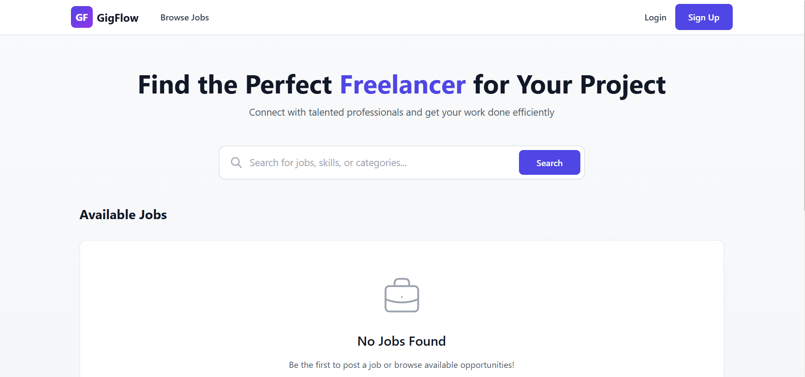
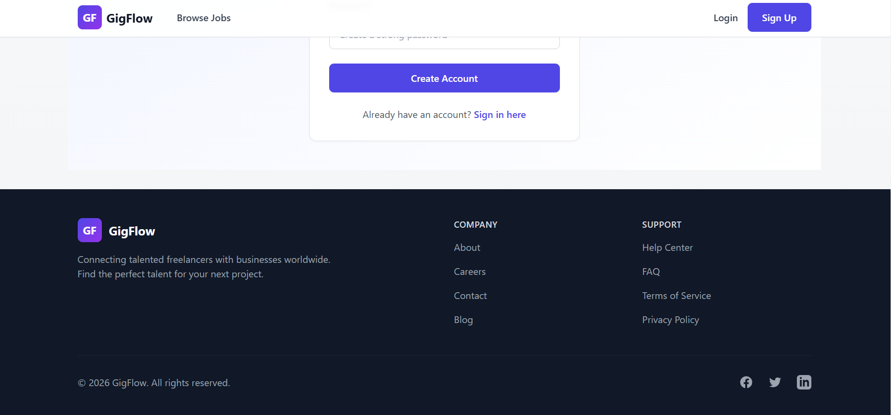
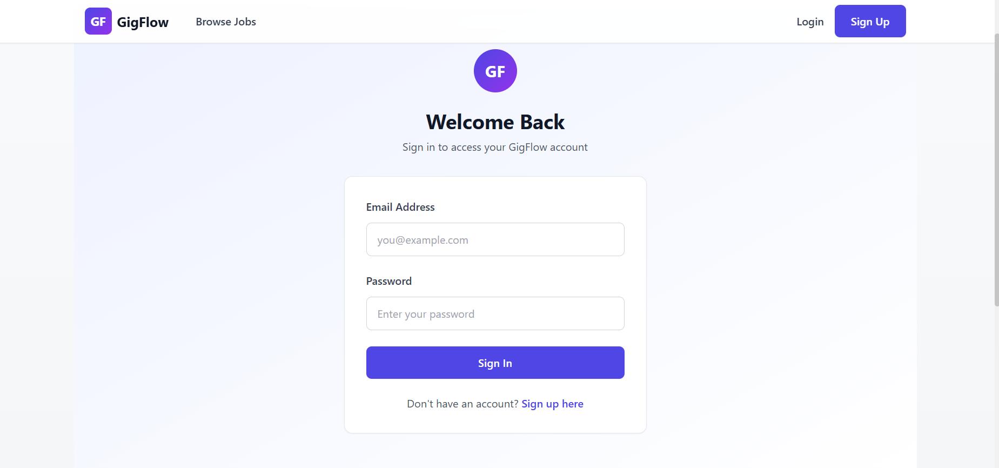
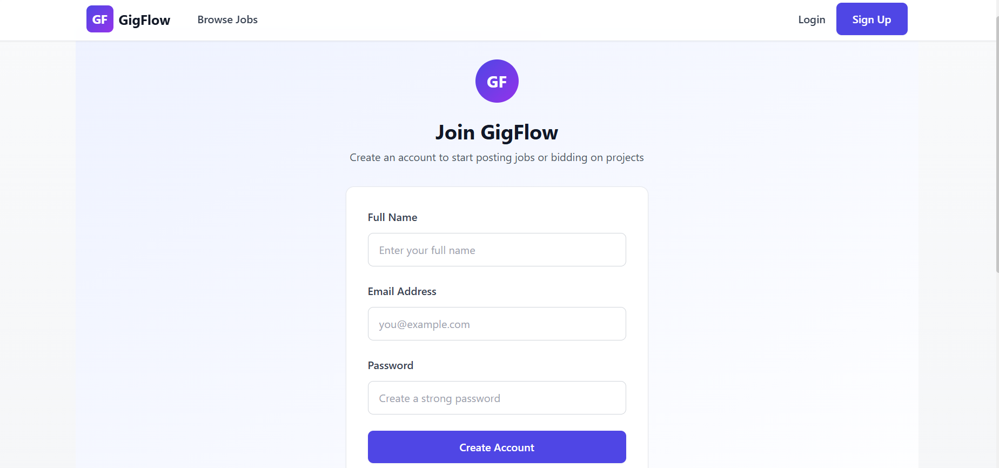

# GigFlow - Freelance Marketplace

GigFlow is a full-stack freelance marketplace built with the MERN stack (MongoDB, Express.js, React.js, Node.js) that allows clients to post jobs (gigs) and freelancers to bid on them.

## Screenshots






## Features

- **User Authentication**: Secure JWT-based authentication with HttpOnly cookies
- **Role-based System**: Fluid roles - any user can act as both client and freelancer
- **Gig Management**: Create, browse, search, and manage job postings
- **Bid System**: Submit proposals and pricing for gigs
- **Hiring Logic**: Atomic hiring process with transactional integrity
- **Real-time Notifications**: Socket.io integration for instant updates
- **Responsive Design**: Mobile-friendly UI with Tailwind CSS

## Tech Stack

- **Frontend**: React.js, Tailwind CSS, Redux Toolkit
- **Backend**: Node.js, Express.js
- **Database**: MongoDB with Mongoose ODM
- **Authentication**: JWT with HttpOnly cookies
- **Real-time Updates**: Socket.io
- **State Management**: Redux Toolkit

## API Endpoints

### Authentication

- `POST /api/auth/register` - Register new user
- `POST /api/auth/login` - Login and set HttpOnly cookie
- `POST /api/auth/logout` - Logout user
- `GET /api/auth/me` - Get current user

### Gigs

- `GET /api/gigs` - Fetch all open gigs (with search query)
- `POST /api/gigs` - Create a new job post
- `GET /api/gigs/:id` - Get a specific gig
- `PUT /api/gigs/:id` - Update a gig (owner only)
- `DELETE /api/gigs/:id` - Delete a gig (owner only)

### Bids

- `POST /api/bids` - Submit a bid for a gig
- `GET /api/bids/gig/:gigId` - Get all bids for a specific gig (owner only)
- `GET /api/bids/my-bids` - Get all bids by current freelancer
- `PATCH /api/bids/:bidId/hire` - Hire a freelancer (atomic operation)
- `PUT /api/bids/:bidId` - Update a bid (freelancer only)
- `DELETE /api/bids/:bidId` - Delete a bid (freelancer only)

## Installation

1. Clone the repository:

```bash
git clone <repository-url>
cd gigflow-mern
```

2. Install dependencies:

```bash
npm run install-all
```

3. Set up environment variables:
   Create a `backend/config.env` file with the following:

```
NODE_ENV=development
PORT=5000
MONGO_URI=mongodb://localhost:27017/gigflow
JWT_SECRET=your-super-secret-jwt-key-change-in-production
JWT_EXPIRE=30d
FRONTEND_URL=http://localhost:5173
```

4. Run the application:

```bash
npm run dev
```

The application will start with:

- Frontend: http://localhost:5173
- Backend: http://localhost:5000

## Database Schema

### User

- `_id`: ObjectId
- `name`: String
- `email`: String (unique)
- `password`: String (hashed)
- `createdAt`: Date
- `updatedAt`: Date

### Gig

- `_id`: ObjectId
- `title`: String
- `description`: String
- `budget`: Number
- `ownerId`: ObjectId (ref: 'User')
- `status`: String (enum: ['open', 'assigned'])
- `createdAt`: Date
- `updatedAt`: Date

### Bid

- `_id`: ObjectId
- `gigId`: ObjectId (ref: 'Gig')
- `freelancerId`: ObjectId (ref: 'User')
- `message`: String
- `price`: Number
- `status`: String (enum: ['pending', 'hired', 'rejected'])
- `createdAt`: Date
- `updatedAt`: Date

## Key Implementation Details

### Transactional Hiring Logic

The hiring process uses MongoDB transactions to ensure atomicity:

- Selected bid status changes to 'hired'
- Associated gig status changes to 'assigned'
- All other bids for the same gig are marked as 'rejected'
- Race condition protection ensures only one freelancer can be hired

### Real-time Notifications

Socket.io is implemented to provide instant notifications:

- Freelancers receive immediate notification when hired
- Clients receive notifications when new bids are submitted

### Security Features

- Passwords are hashed using bcrypt
- JWT tokens stored in HttpOnly cookies
- Input validation and sanitization
- Authorization checks for all protected routes

## Bonus Features Implemented

1. **Transactional Integrity**: The hiring logic uses MongoDB transactions to ensure atomic operations and prevent race conditions.

2. **Real-time Updates**: Socket.io integration provides instant notifications to users without requiring page refreshes.

## Usage

1. Register an account or login
2. As a client: Post a new gig with title, description, and budget
3. As a freelancer: Browse gigs and submit bids with proposals
4. As a client: Review bids and hire the best freelancer
5. Receive real-time notifications when hired or when new bids arrive

## Development

This project follows modern development practices:

- Component-based architecture
- State management with Redux Toolkit
- Proper error handling
- Input validation
- Security best practices
- Responsive design
